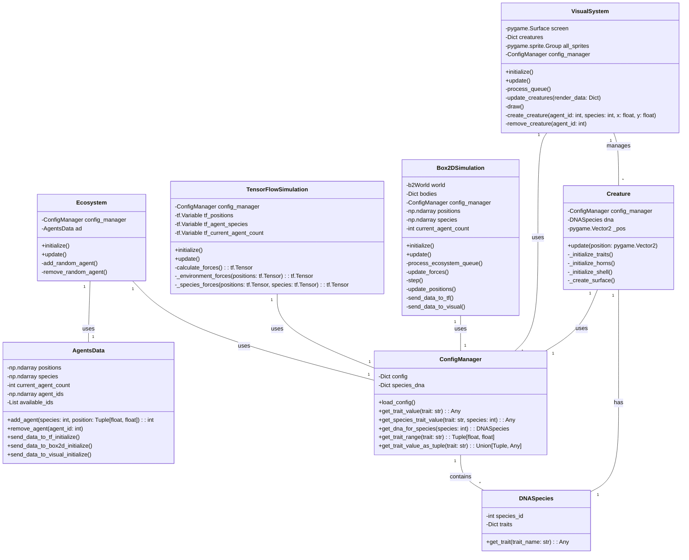

```mermaid
classDiagram
    class ConfigManager {
        -Dict config
        -Dict species_dna
        +load_config()
        +get_trait_value(trait: str) : Any
        +get_species_trait_value(trait: str, species: int) : Any
        +get_dna_for_species(species: int) : DNASpecies
        +get_trait_range(trait: str) : Tuple[float, float]
        +get_trait_value_as_tuple(trait: str) : Union[Tuple, Any]
    }

    class DNASpecies {
        -int species_id
        -Dict traits
        +get_trait(trait_name: str) : Any
    }

    class AgentsData {
        -np.ndarray positions
        -np.ndarray species
        -int current_agent_count
        -np.ndarray agent_ids
        -List available_ids
        +add_agent(species: int, position: Tuple[float, float]) : int
        +remove_agent(agent_id: int)
        +send_data_to_tf_initialize()
        +send_data_to_box2d_initialize()
        +send_data_to_visual_initialize()
    }

    class Ecosystem {
        -ConfigManager config_manager
        -AgentsData ad
        +initialize()
        +update()
        -add_random_agent()
        -remove_random_agent()
    }

    class TensorFlowSimulation {
        -ConfigManager config_manager
        -tf.Variable tf_positions
        -tf.Variable tf_agent_species
        -tf.Variable tf_current_agent_count
        +initialize()
        +update()
        -calculate_forces() : tf.Tensor
        -_environment_forces(positions: tf.Tensor) : tf.Tensor
        -_species_forces(positions: tf.Tensor, species: tf.Tensor) : tf.Tensor
    }

    class Box2DSimulation {
        -b2World world
        -Dict bodies
        -ConfigManager config_manager
        -np.ndarray positions
        -np.ndarray species
        -int current_agent_count
        +initialize()
        +update()
        -process_ecosystem_queue()
        -update_forces()
        -step()
        -update_positions()
        -send_data_to_tf()
        -send_data_to_visual()
    }

    class VisualSystem {
        -pygame.Surface screen
        -Dict creatures
        -pygame.sprite.Group all_sprites
        -ConfigManager config_manager
        +initialize()
        +update()
        -process_queue()
        -update_creatures(render_data: Dict)
        -draw()
        -create_creature(agent_id: int, species: int, x: float, y: float)
        -remove_creature(agent_id: int)
    }

    class Creature {
        -ConfigManager config_manager
        -DNASpecies dna
        -pygame.Vector2 _pos
        +update(position: pygame.Vector2)
        -_initialize_traits()
        -_initialize_horns()
        -_initialize_shell()
        -_create_surface()
    }

    ConfigManager "1" -- "*" DNASpecies : contains
    Ecosystem "1" -- "1" AgentsData : uses
    Ecosystem "1" -- "1" ConfigManager : uses
    TensorFlowSimulation "1" -- "1" ConfigManager : uses
    Box2DSimulation "1" -- "1" ConfigManager : uses
    VisualSystem "1" -- "1" ConfigManager : uses
    VisualSystem "1" -- "*" Creature : manages
    Creature "1" -- "1" ConfigManager : uses
    Creature "1" -- "1" DNASpecies : has
```