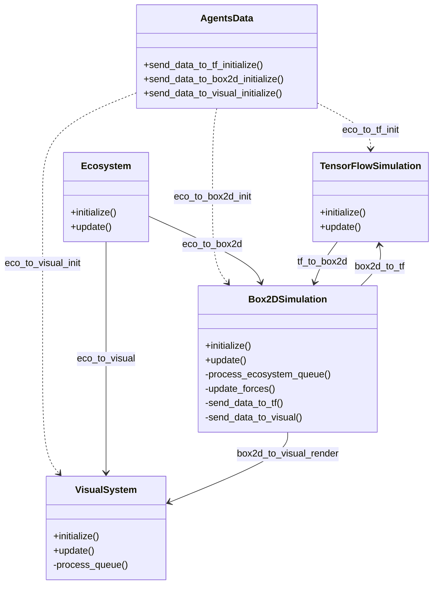

```mermaid
classDiagram
    class AgentsData {
        +send_data_to_tf_initialize()
        +send_data_to_box2d_initialize()
        +send_data_to_visual_initialize()
    }

    class Ecosystem {
        +initialize()
        +update()
    }

    class TensorFlowSimulation {
        +initialize()
        +update()
    }

    class Box2DSimulation {
        +initialize()
        +update()
        -process_ecosystem_queue()
        -update_forces()
        -send_data_to_tf()
        -send_data_to_visual()
    }

    class VisualSystem {
        +initialize()
        +update()
        -process_queue()
    }

    AgentsData ..> TensorFlowSimulation : eco_to_tf_init
    AgentsData ..> Box2DSimulation : eco_to_box2d_init
    AgentsData ..> VisualSystem : eco_to_visual_init
    Ecosystem --> Box2DSimulation : eco_to_box2d
    Ecosystem --> VisualSystem : eco_to_visual
    TensorFlowSimulation --> Box2DSimulation : tf_to_box2d
    Box2DSimulation --> TensorFlowSimulation : box2d_to_tf
    Box2DSimulation --> VisualSystem : box2d_to_visual_render
```