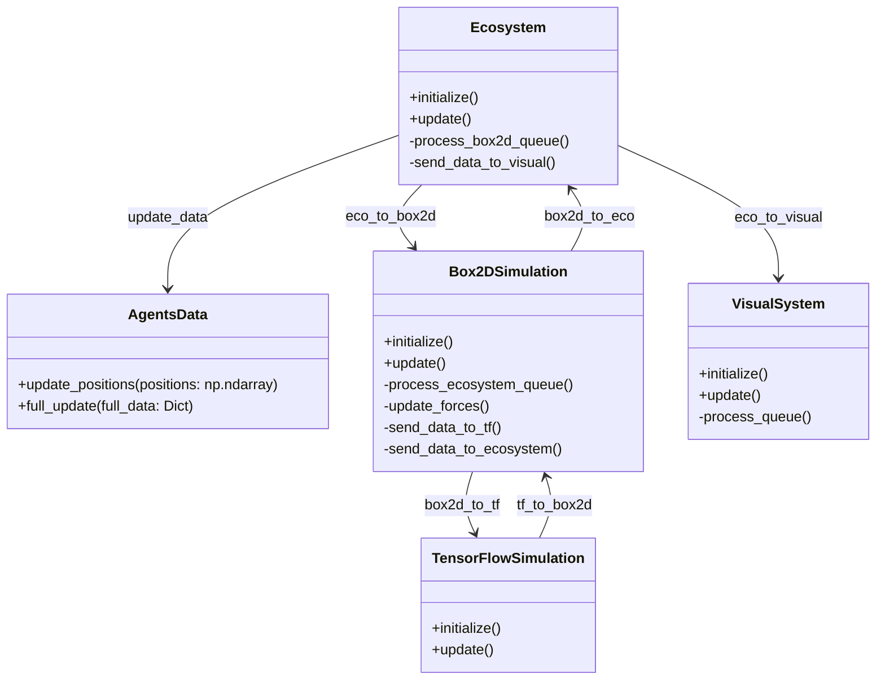

```mermaid
classDiagram
    class AgentsData {
        +update_positions(positions: np.ndarray)
        +full_update(full_data: Dict)
    }

    class Ecosystem {
        +initialize()
        +update()
        -process_box2d_queue()
        -send_data_to_visual()
    }

    class TensorFlowSimulation {
        +initialize()
        +update()
    }

    class Box2DSimulation {
        +initialize()
        +update()
        -process_ecosystem_queue()
        -update_forces()
        -send_data_to_tf()
        -send_data_to_ecosystem()
    }

    class VisualSystem {
        +initialize()
        +update()
        -process_queue()
    }

    Ecosystem --> Box2DSimulation : eco_to_box2d
    Ecosystem --> VisualSystem : eco_to_visual
    TensorFlowSimulation --> Box2DSimulation : tf_to_box2d
    Box2DSimulation --> TensorFlowSimulation : box2d_to_tf
    Box2DSimulation --> Ecosystem : box2d_to_eco
    Ecosystem --> AgentsData : update_data
```