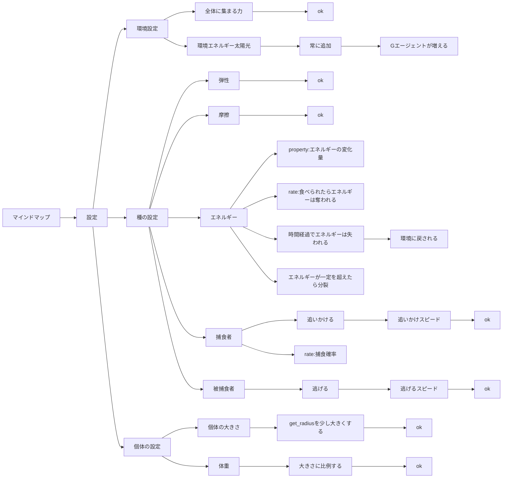

```mermaid

graph LR
    A[マインドマップ] --> B[設定]
    B --> C[環境設定]
    B --> D[種の設定]
    B --> E[個体の設定]

    C --> C1[全体に集まる力]
    C1 --> C1a[ok]
    C --> C2[環境エネルギー太陽光]
    C2 --> C2a[常に追加]
    C2a --> C2a1[Gエージェントが増える]

    D --> D1[弾性]
    D --> D2[摩擦]
    D2 --> D2a[ok]
    D --> D3[エネルギー]
    D3 --> D3a["property:エネルギーの変化量"]
    D3 --> D3b["rate:食べられたらエネルギーは奪われる"]
    D3 --> D3c[時間経過でエネルギーは失われる]
    D3c --> D3c1[環境に戻される]
    D3 --> D3d[エネルギーが一定を超えたら分裂]
    D --> D4[捕食者]
    D4 --> D4a[追いかける]
    D4a --> D4a1[追いかけスピード]
    D4a1 --> D4a1a[ok]
    D4 --> D4b["rate:捕食確率"]
    D --> D5[被捕食者]
    D5 --> D5a[逃げる]
    D5a --> D5a1[逃げるスピード]
    D5a1 --> D5a1a[ok]

    E --> E1[個体の大きさ]
    E1 --> E1a[get_radiusを少し大きくする]
    E1a --> E1a1[ok]
    E --> E2[体重]
    E2 --> E2a[大きさに比例する]
    E2a --> E2a1[ok]
    D1 --> node_1
    node_1["ok"]

```